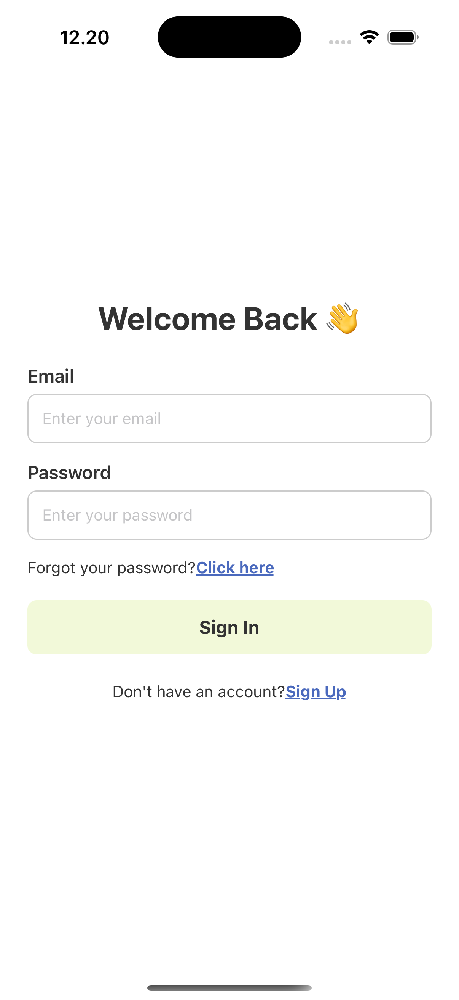
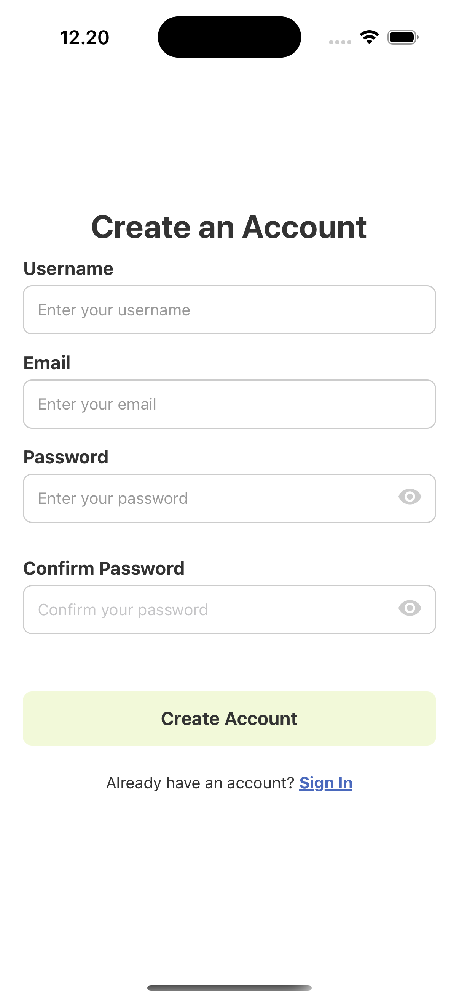
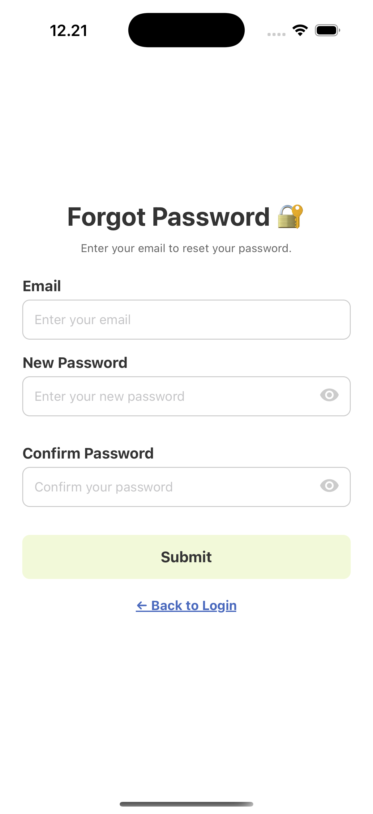
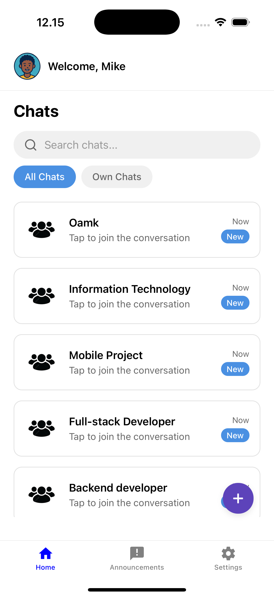
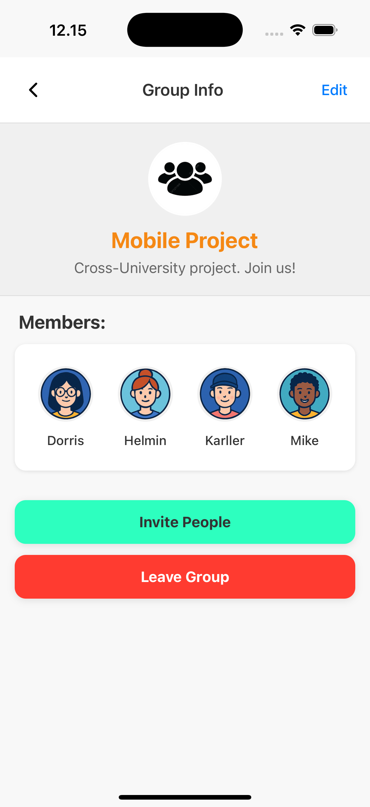
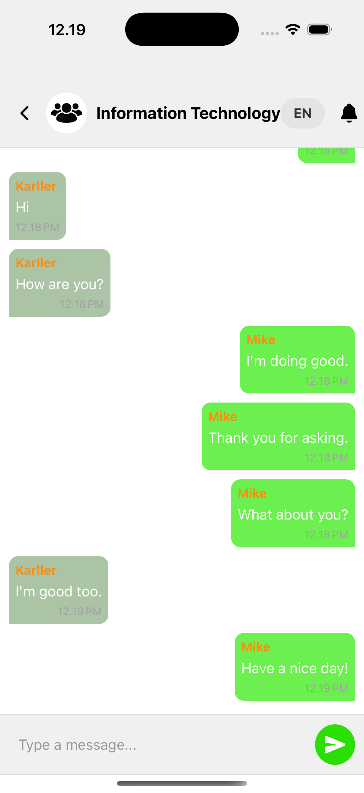
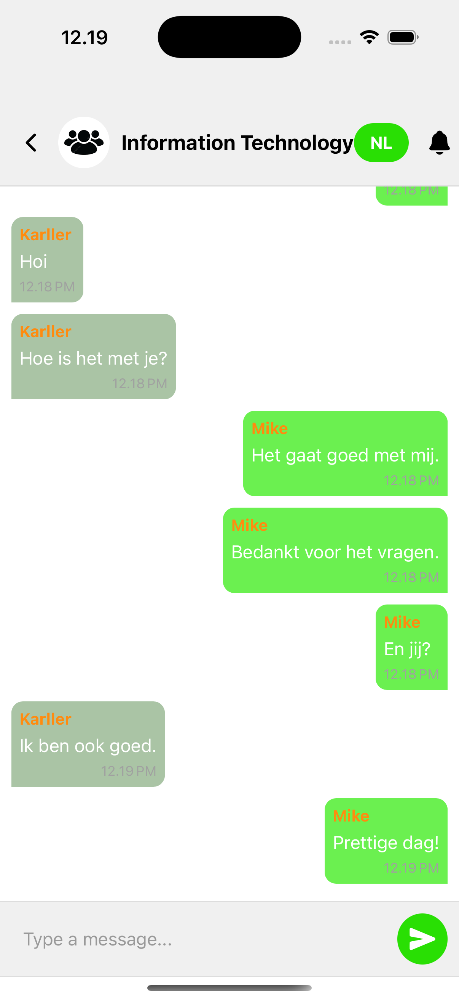
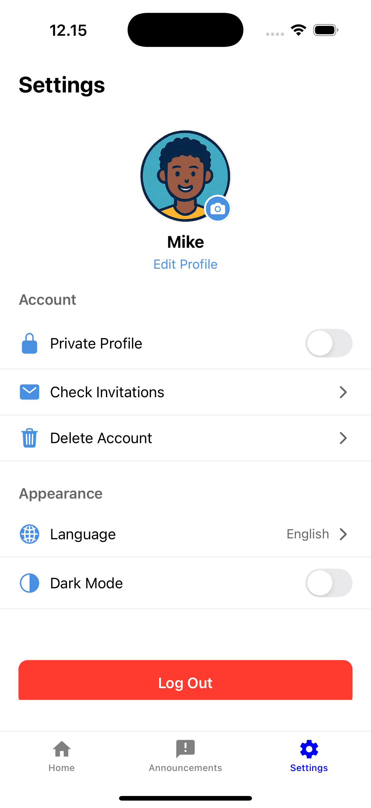
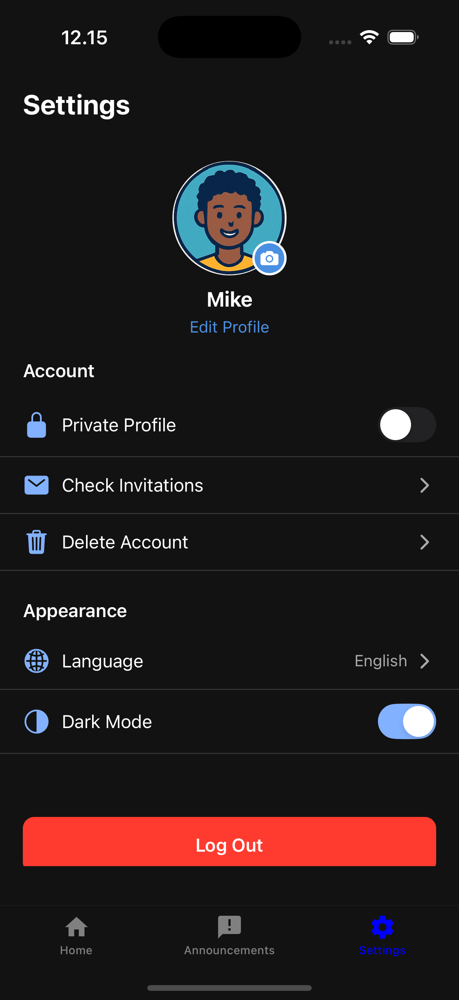

# UniChat 👋

UniChat is a cross-university mobile application built as a collaborative project between students at **Oulu University of Applied Sciences (OAMK)** and **Fontys University of Applied Sciences (Fontys)**.

The goal is to provide a modern, student-friendly chat app with:

- Secure authentication and user profiles
- Group chats for courses and projects
- Basic announcement system
- In-chat translation between English, Finnish and Dutch
- Mobile-first experience (React Native + Expo)

> 💡 This is an educational project, not a production-ready app.

---

## 📱 Main Features

As a whole, the UniChat project aims to provide:

#### User Accounts & Authentication

- Register and log in with the UniChat backend
- Persist login state on the device
- Basic validation and feedback for incorrect credentials
- Reset the password when user has forgotten the previous one

#### User Profiles & Avatars

- View and update basic profile info
- Choose a profile avatar from predefined images
- Display avatar in headers, chat lists, and user-related UI

#### Chatrooms

- View available chatrooms (e.g., courses, project groups, topics)
- Enter a room and see its messages
- Send new messages when connected to the running backend

#### Real-Time Messaging

- The backend uses **SignalR** to handle real-time communication.
- Under the hood, SignalR prefers **WebSocket** when available, so:
  - When a user sends a message in a chatroom, other online members can receive it **instantly**, without refreshing.
  - The server and clients keep a long-lived connection open and can push messages both ways.

#### Group Announcements

- Each chatroom supports announcements posted by users
- Announcements are used for important messages within a group (e.g. project updates, deadlines, general notices)
- Announcements are visible when the user opens the corresponding group

#### In-Chat Translation (EN / FI / NL)

- Each chatroom has a language toggle in the top-right corner (EN, FI, NL).
- When the user taps it, the visible messages are translated into the selected language.
- This is designed for mixed groups of OAMK and Fontys students and staff, so everyone can follow the conversation in a familiar language.

#### Student-Friendly UX

- Toast messages for success and error states
- Loading indicators during network activity
- Clear navigation between authentication, home, chatrooms, and other key screens

---

## ⚓️ Architecture Overview

UniChat is split into **three main parts**:

1. **Frontend** – React Native app (Expo)
2. **Backend API** – ASP.NET Core Web API (.NET)
3. **Database** – PostgreSQL (in Docker)

Data flow:

- Mobile app → sends HTTP requests with JWT in header → Backend API
- Backend API → uses Entity Framework Core to access PostgreSQL → returns JSON responses

---

## 🧩 Tech Stack

UniChat is built as a **full-stack system**: a React Native mobile app (client) that talks to an ASP.NET Core backend API service.

#### Mobile App

- React Native (Expo)
- TypeScript
- Navigation (e.g. stack/tab navigation)
- AsyncStorage for persistent login state
- Toast-style notifications for user feedback
- Reusable components for announcements, groups, chat messages, etc.

#### Backend

- C#
- ASP.NET Core Web API
- REST API endpoints for:
  - Authentication and user management
  - Chatrooms, messages and announcements
- Integration with a relational database
- SignalR for real-time messaging, built on top of:
  - WebSocket when supported
  - Automatic fallback transports when WebSocket is not available

#### Database & Infrastructure

- PostgreSQL
- Docker / Docker Compose
- EF Core migrations (`dotnet ef`)

---

## 📁 Project Structure

         💬 UniChat/
             ┣ UniChat-FrontEnd/            # React Native (Expo) mobile app
             ┃ ┣ app/                       # Screens & navigation (Expo Router)
             ┃ ┣ components/                # Reusable UI components
             ┃ ┣ contexts/                  # AuthContext, ThemeContext, ChatContext, SignalRContext
             ┃ ┣ services/                  # API services (auth, chat, translate, etc.)
             ┃ ┗ ...
             ┣ UniChat-BackEnd/             # ASP.NET Core Web API
               ┣ UniChat_BLL/
               ┃ ┣ Dto/
               ┃ ┣ Interfaces/
               ┃ ┣ Services/
               ┃ ┗ ...
               ┣ UniChat_DAL/               # Data Access Layer (EF Core, entities, migrations)
               ┃ ┣ Data/
               ┃ ┣ Entities/
               ┃ ┣ Migrations/
               ┃ ┣ docker-compose.yml
               ┃ ┣ Repository/
               ┃ ┗ ...
               ┗ UniChat-BackEnd/           # Web API project
                 ┣ Controllers/
                 ┣ Hubs/
                 ┣ Properties/
                 ┣ appsettings.json
                 ┣ Program.cs/
                 ┗ ...

> This tree shows the overall UniChat solution structure (frontend + backend).
>
> **Original Team Repositories**
>
> - **Frontend repository:**
>
>   `https://github.com/Mobile-Project-ChatApp/UniChat-FrontEnd`
>
> - **Backend repository:**
>
>   `https://github.com/Mobile-Project-ChatApp/UniChat-BackEnd`
>
> This repository (`t3cozh00/unichat-frontend`) is a **fork** of the original frontend repository.
>
> All credit for the overall UniChat concept and backend implementation goes to the full student team and course supervisors.

---

## ▶️ Demo: Screenshots & Recording

#### 🎥 Demo Video

[▶️ Watch the UniChat demo](#)

<!-- https://youtu.be/6jH2R_F63a8 -->

#### 🖼 Screenshots

**Welcome Page**

  <p align="left">
     
  </p>
  <br>
  
  **Authentication**

<p align="left">
  
  
  
</p>
<br>

**Chatrooms & Translations**

<p align="left">
  
   
</p>
<br>
<p align="left">
   
  
  
</p>
<br>

**Settings & Profile**

<p align="left">
  
  
</p>

---

## 🙋‍♀️ My Role in the Project

UniChat is a **team project**, and this repository focuses on the mobile app part of the system.

My personal contributions were mainly on the **mobile app side**, including:

#### Authentication Flow

- Implementing login and registration screens
- Wiring forms to backend authentication endpoints
- Handling success / error responses and showing toast messages
- Managing persistent login using AsyncStorage

#### User Profile & Avatar Selection

- Building the avatar selection UI and interaction
- Making sure the chosen avatar is visible across the app (e.g., header, profile area)
- Coordinating with backend to store a public avatar URL or identifier

#### UX Consistency & Structure

- Ensuring consistent loading and error handling between login and register
- Participating in UI/UX decisions to keep the app student-friendly and easy to understand
- Helping structure screens and navigation to support future features

---

## 🚀 Getting Started

#### 1. Prerequisites

Make sure you have:

- Node.js (LTS)
- npm
- Expo CLI
- .NET SDK (matching your backend, e.g. .NET 8/9)
- Docker Desktop

#### 2. Environment Variables

You will need to configure:

- Backend
  - `UniChat-BackEnd/appsettings.json` (or `appsettings.Development.json`)
- Frontend

  - e.g. `UniChat-FrontEnd/apiConfig.ts` or `.env` for `API_BASE_URL`

- PostgreSQL (Docker)
  - `UniChat_DAL/docker-compose.yml` (or `docker-compose.yml` in the DB folder)

#### 3. Start Backend & Database

- **Start PostgreSQL with Docker**

  ```bash
  cd UniChat_DAL

  docker compose up -d
  ```

- **Apply EF Core migrations**

  ```bash
  cd UniChat-BackEnd

  dotnet ef database update --project UniChat_DAL --startup-project UniChat-BackEnd
  ```

- **Run the backend API**

  ```bash
  cd UniChat-BackEnd

  dotnet run
  ```

  > If the project is running, go to the URL with /swagger/index.html at the end in your browser.

- **Start the Frontend (React Native / Expo)**

  ```bash
  cd UniChat-FrontEnd

  npm install

  npx expo start
  ```
